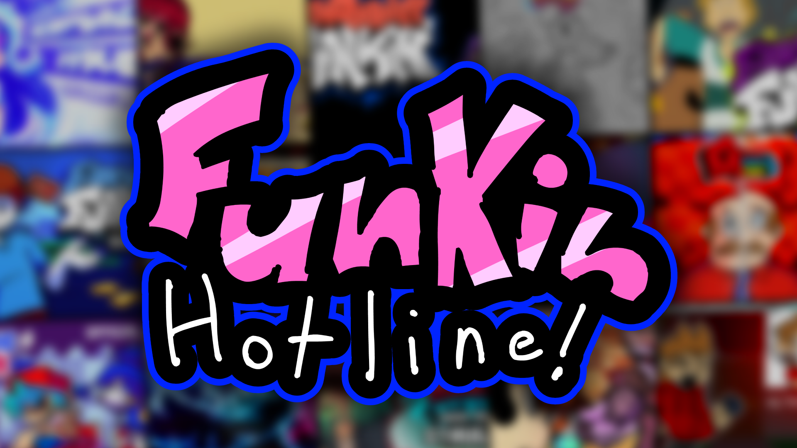
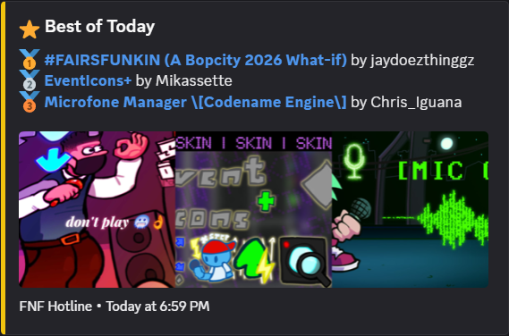

# Funkin Hotline



Posts the top FNF mods from GameBanana to a Discord channel every 2 hours. Shows the best mods of all time, year, 6 months, 3 months, month, week, and today with a little image collage.



this is just a fun thing. commit names are stupid and vary. i don't take this project seriously.

## config

Edit `config.json` to enable/disable periods, rename them, or change colors/emojis.

```bash
# see what periods are available from the API
python scripts/list-periods.py
```

```json
{
  "max_per_period": 3,
  "periods": {
    "today": { "enabled": true,  "name": "Best of Today",   "emoji": "\u2b50", "color": "#f1c40f" },
    "week":  { "enabled": false, "name": "Best of the Week", "emoji": "\ud83d\udd25", "color": "#e67e22" }
  }
}
```

Set `"enabled": false` to hide a period. Change `name`, `emoji`, or `color` to customize.

## live view

See it live in [#funkin-hotline](https://discord.com/channels/1447703759638626327/1524145705936097351) on the [Funkin Hotline Discord](https://discord.gg/yQvZ69fsm3).

## structure

```
├── src/           python source
├── assets/        images
├── scripts/       utility scripts
├── config.json    enable/disable & customize periods
├── state.json     tracks last posted mods
└── .github/
    └── workflows/ github actions cron
```

## how to fork & use

1. **Fork** this repo on GitHub
2. **Create a Discord webhook** in your server channel → copy the URL
3. Go to your fork → **Settings → Secrets and variables → Actions** → add `DISCORD_WEBHOOK_URL` with your webhook URL
4. Go to **Actions** tab → enable workflows → run "Funkin Mod Rankings" manually to test
5. It'll auto-run every 30 minutes after that

### reset state

Clears `state.json` so the next run posts fresh Discord messages:

```bash
# windows
powershell ./scripts/reset-state.ps1

# linux/macos
bash ./scripts/reset-state.sh
```

that's it.
